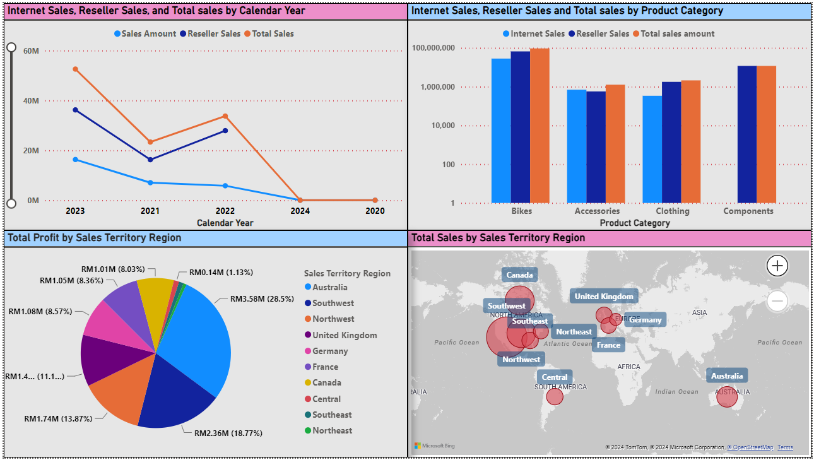
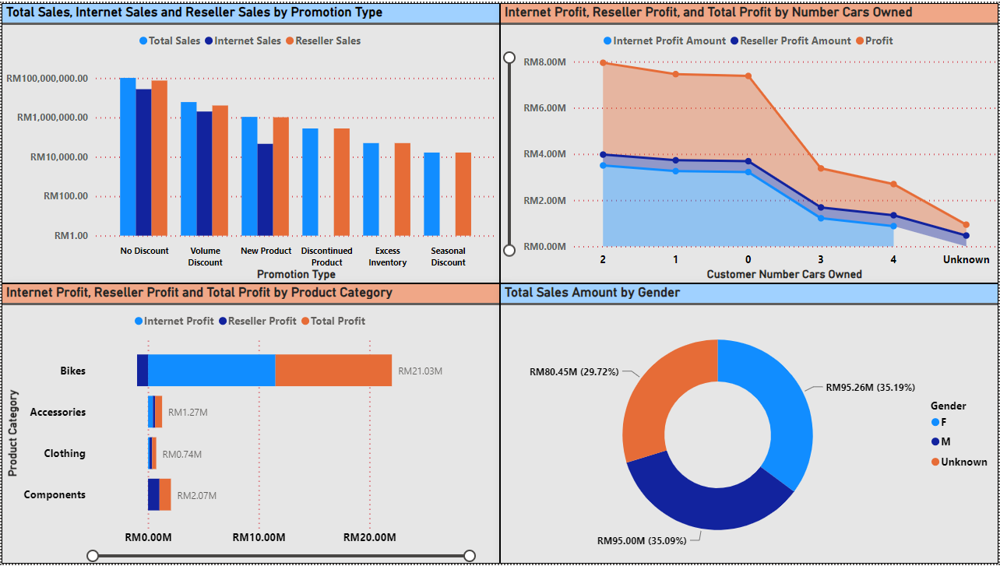
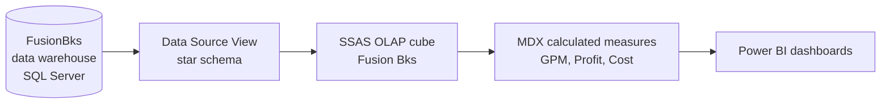

# Fusion Bikes Corporation — Business Intelligence System

An end-to-end Business Intelligence solution for a global bicycle manufacturer, built on the Microsoft BI stack: a dimensional data warehouse on **SQL Server**, an OLAP cube developed with **SSAS (Visual Studio / SSDT)**, custom **MDX** measures, and interactive **Power BI** dashboards analysing sales and profitability across channels, regions, products and customer segments.

Developed following the **CRISP-DM** methodology, from business understanding through deployment.

## Dashboards

**Sales Performance Overview** — Internet vs Reseller vs Total sales by calendar year, sales by product category, total sales by territory on a map, and profit share by sales territory region:



**Profit & Sales Overview** — sales by promotion type, profit by customer car-ownership segment, profit by product category, and sales split by gender:



## Architecture



- **Fact + 7 dimensions:** Customer, Product, Promotion, Sales Territory, Date, Employee, Reseller — modelled in the Data Source View and exposed through the cube.
- **MDX calculated measures:** Internet GPM (Gross Profit Margin), Internet Profit Amount, Reseller Profit Amount, overall Profit, Total Cost of Product, Total GPM, and Total Sales Amount — computed in the cube so every dashboard visual aggregates consistently.
- **Analysis delivered:** channel mix (Internet vs Reseller), regional profitability (Australia and Southwest leading), product-category concentration (Bikes dominate revenue and profit), promotion effectiveness, and customer-demographic segmentation.

## Repository contents

```
BISProject/          SSAS multidimensional project (Visual Studio/SSDT solution)
  *.dim              7 dimension definitions
  Fusion Bks 1.cube  Cube definition with measure groups and MDX calculations
  Fusion Bks 1.dsv   Data Source View over the FusionBks warehouse
  Fusion Bks.ds      Data source (SQL Server, integrated security)
PowerBI/
  BIS_visualization.pbix   The Power BI report (connects to the deployed cube)
assets/              Dashboard screenshots
```

## Opening it

1. Restore the `FusionBks` data warehouse to a SQL Server instance and update the connection in `BISProject/Fusion Bks.ds`.
2. Open `BISProject/BISProject.sln` in Visual Studio with SQL Server Data Tools (SSAS project support), deploy and process the cube.
3. Open `PowerBI/BIS_visualization.pbix` in Power BI Desktop and point the data source at the deployed cube.

## Project context

Individual assignment for the Business Intelligence Systems module (BSc (Hons) Computer Science — Data Analytics, Asia Pacific University).

## Author

**Abdelrahman Abu Reidy** — [github.com/AbdelrahmanAbuReidy](https://github.com/AbdelrahmanAbuReidy)
